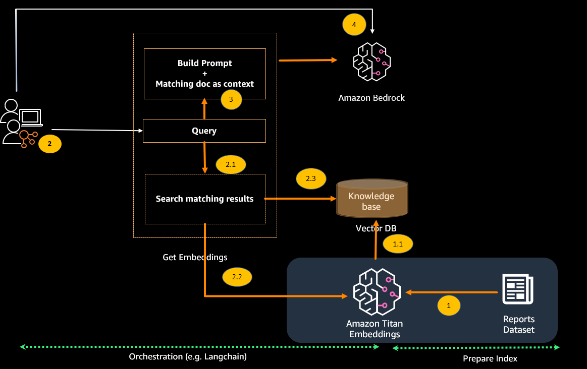

# Evaluation of Generative AI techniques for clinical report summarization

Our primary goal it to explore few of the prompt engineering techniques that will help assess the capabilities and limitations of LLMs for the healthcare domain specific summarization task. We evaluate the result with various promoting techniques. For more complex and clinical knowledge-intensive tasks, it's possible to build a language model-based system that accesses external knowledge sources to complete tasks. This enables more factual consistency, improves reliability of the generated responses, and helps to mitigate the problem of "hallucination", with RAG technique we demonstrate how the results are comparatively better. 

## Dataset 

The MIMIC Chest X-ray (MIMIC-CXR) Database v2.0.0 is a large publicly available dataset of chest radiographs in DICOM format with free-text radiology reports. We used the [MIMIC CXR dataset](https://physionet.org/content/mimic-cxr/2.0.0/) which can be accessed through a data use agreement, which requires user registration and completion of a credentialing process. During routine clinical care, clinicians trained in interpreting imaging studies (radiologists) will summarize their findings for a particular study in a free-text note. Radiology reports for the images were identified and extracted from the hospital EHR system. The reports were de-identified using a rule-based approach. Because we used only the radiology report text data, we downloaded just one compressed report file (mimic-cxr-reports.zip) from the MIMIC-CXR website. We used 2,000 reports (referred to as the dev1 dataset) from the separate held out subset of this dataset for evaluation. We use another 2,000 radiology reports (referred to as dev2) for evaluating from the chest X-ray collection from the Indiana University hospital network. 

## Techniques 

Here we explore 3 patterns :
1. Zero-Shot prompting 
2. Few-Shot prompting 
3. Retrieval augmented generation (RAG) 

Prompt Engineering is related to the Template Definition. Different templates can be used to express the same concept. Hence it is essential to carefully design the templates for exploiting the capability of a language model A prompt task is defined by a by prompt engineering, once the prompt template is defined, model generate multiple tokens that can fill a prompt template. For instance, “Generate radiology report impressions based on the following findings and output it within <impression> tags”. In this case, a model can fill the <impression> with tokens. 

### Zero-Shot prompting 
Zero-shot prompting implies providing a prompt to a large language model that is not part of the training data to the model. With a single prompt, the model should still generate a desired result. This technique makes large language models useful for many tasks and we used it to generate impressions from the findings section of a radiology report.
Here we have leverage Claude v2 model with Amazon Bedrock and provided prompt .

`prompt_zero_shot = """Human: Generate radiology report impressions based on the following findings and output it within <impression> tags. Findings: {}
Assistant:"""`

### Few-Shot prompting
Few-shot prompting leverages a small set of input-output examples to train the model for
specific tasks. The benefit of this technique is that it doesn’t require large amount of labelled
data (examples), and performs reasonably well by providing guidance to large language models.
In this work, we provided 5 examples of findings and impressions to the model for few-shot

examples_string = ''
for ex in examples:
    examples_string += f"""H:<findings>{ex['findings']}</findings>
    
A:<impression>{ex['impression']}</impression>\n"""
    
    
prompt_few_shot = """Human: Generate radiology report impressions based on the following findings. Findings: 
<findings>{}</findings>
        
Here are a few examples:
<examples>
""" + examples_string + """
</examples>

Assistant:"""

### Retrieval augmented generation (RAG) 
The final comparison is with RAG technique.The RAG pattern builds on prompt engineering. Instead of a user providing relevant data, an
application intercepts the user's input. The application searches across a data repository to
retrieve content relevant to the question or input. The application feeds the data that it finds to
the generative AI model to generate content. 
To implement our RAG system, we utilized a dataset of 95,000 radiology report findings-
impressions pairs as the knowledge source. This dataset was ingested using the Langchain
document loader. Next, we generated embedding vectors for the loaded documents by passing
them through the Titan Text Embedding model on Amazon Bedrock. The output vector
representations were stored in a FAISS vector store for efficient retrieval. With the infrastructure
in place, we set up a pipeline leveraging Langchain for prompt engineering and retrieval, FAISS
for vector similarity search, and the Anthropic Claudev2 for inference and impressions
generation. Together, these components enabled both precise document retrieval and high-
quality conditional text generation from the findings to impressions dataset. The modular
combination of cutting-edge AI libraries allowed rapid implementation and experimentation with
the latest RAG techniques

----------------------------------------------------------------------------------------------------------------------------------------
## Authors and acknowledgment
Special thanks to Wale Akinfaderin, Srushti Kotak , Ekta Walia Bhullar, Priya Padate and  for their contributions to this project and sharing their expertise in this field.

----------------------------------------------------------------------------------------------------------------------------------------
## License
This library is licensed under the MIT-0 License. See the LICENSE file.

